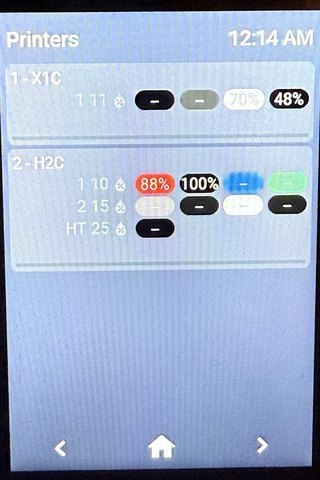

# ESPHome + LVGL on cheap touchscreen devices

[](https://ko-fi.com/S6S21K2LK2)

## Supported Devices
* Guition `JC3248W535` 3.5" 320x480 portrait, with capacitive touch and USB-C. [AliExpress Link](https://www.aliexpress.com/item/1005007566046827.html).
* Sunton `ESP32-2432S028R` 2.8" 240x320 portrait, with resistive touch and USB micro-B. [AliExpress Link](https://www.aliexpress.com/item/1005004502250619.html).
* Sunton `ESP32-8048S043` 4.3" 480x800 portrait, with capactivive touch and USB-C. [AliExpress Link](https://www.aliexpress.com/item/1005004788147691.html).
* Sunton `ESP32-8048S050` 5.0" 480x800 portrait, with capactivive touch and USB-C. [AliExpress Link](https://www.aliexpress.com/item/1005004952694042.html).
* Elecrow CrowPanel `DIS05035H` (v2.2) 3.5" 320x480 portrait, with resistive touch and USB-C. [Manufacturer's Link](https://www.elecrow.com/esp32-display-3-5-inch-hmi-display-spi-tft-lcd-touch-screen.html).

## Changelog
### 2026-09-21
* New `features/` directory for behaviour a panel may or may not want, kept out of the device files (hardware only) and the layouts (pages only). Each is opted into from the top-level `packages:`, listed **after** `layout:`. Every setting is a Home Assistant control whose starting value is a substitution, so YAML sets the default and HA can change a running panel without a reflash:
  * `features/idle/idle.yaml`: dim, go home and sleep after configurable idle times (Dim after, Dim level, Go home after, Sleep after; 0 = never), wake on touch, a Sleep now button, and holding the footer's Home button for 1.5s to sleep.
  * `features/idle/sun.yaml` / `ambient_light.yaml`: the brightness ceiling, from `sun.sun` or from a board's `ambient_light` sensor.
  * `features/sleep_clock/sleep_clock.yaml`: a dim split-flap clock in place of the dark sleep, with its own brightness and optional red night colours.
  * `features/diagnostics/memory.yaml` / `psram.yaml`: heap, loop-time and PSRAM sensors for chasing a leak.
* `common.yaml` now always reports **Uptime** and **Reset Reason**, so an unexplained restart leaves evidence.
* [Breaking change] **Restart** is now a button rather than a switch, so Home Assistant shows it as an action instead of an on/off state. Its entity moves from `switch.<name>_restart` to `button.<name>_restart`; update any automation or dashboard that pressed the old one, and delete the orphaned switch.
* **Uptime** reports the boot time, once per boot, rather than a seconds count every minute. Home Assistant shows it as "3 hours ago". If it reads unavailable after the update, reload the device in Settings > Devices & services > ESPHome: Home Assistant keeps the old seconds unit on the existing entity and rejects the new value.
* Every layout goes home from `esphome: on_boot` instead of from the `splash` page's `on_load`, so boot no longer depends on `splash` being the first page. A layout of your own that copied the old `splash` should do the same.
* A **24-hour time** switch (in the shared header package) sets the header clock, the sleep clock and the printer end times.
* `devices/SDL.yaml` declares its touchscreen as a list, like every other device file, so features can `!extend` it.
* ESPHome 2026.9.0's bundled LVGL 9.5.0 leaks memory for every frame that draws an object scaled to 0 (fixed in LVGL 9.6.0; esphome/esphome#19439). If you animate `transform_scale_x/y`, hide the object while its scale is 0.
### 2026-09-20
* [Breaking change] Personal and example layouts are now separate files. `layouts/480x320.yaml` and `layouts/800x480.yaml` are back to upstream's generic demo content (`light.kitchen_light`, printers Fred/Wilma/Barney), and the personalised version moved to `layouts/480x320-home.yaml`. Only `home35.yaml` and the new `sdl-home.yaml` use it; every `*-example.yaml` builds the generic ones again. If you had been building an example config and getting someone else's entities, that is what this fixes.
* The generic layouts' printers pages were recomposed onto `widgets/printers/tile_combined.yaml` + `printer_combined.sensors.yaml`, reproducing upstream's single-AMS combined line with the current widget set. The old `widgets/printers/widget.yaml` and `sensors.yaml` remain removed.
* Added `sdl-home.yaml`, so the personal layout can still be previewed in an SDL window; `sdl-example.yaml` now previews the generic one.
* The `480x320` printer page is now composed from `widgets/printers/tile.yaml` (the whole tile body) and one `widgets/printers/printer.sensors.yaml` per printer (core sensors plus all twelve AMS slots), instead of six row includes and 38 sensor includes spelled out per printer. Adding a printer is three lines on the page and four in `packages:`. The resolved config is unchanged, so no reflash is needed; a layout that composes its own tiles inline, as `800x480` does, keeps working untouched.
* The tile body is now a per-printer choice. `widgets/printers/tile.yaml` is the stacked format (a name line, then a self-revealing row per AMS unit); `widgets/printers/tile_combined.yaml` is upstream's original shape, with the printer name and one unit's four pills on a single line. Combined costs one line less but is statically visible and single-AMS, so it suits a machine whose one AMS is always present. Pair each with the matching `printer.sensors.yaml` or `printer_combined.sensors.yaml` — mismatching them fails at config time.
* The four tray pills moved to `widgets/printers/ams_tray_strip.yaml`, shared by the stacked row and the combined line. No visual change: the resolved config for the `800x480` boards is identical.
* The leaf widget and sensor files are otherwise unchanged, and so is the contract that a stateful pair shares a `uid`. What is new is that an `!include` inherits the vars of the file that included it, so the nesting needs no pass-through boilerplate, and that a var can select the include's filename (`ams_row${variant}.sensors.yaml`).
### 2026-09-18
* [Breaking change] The printer tile is now composed in the layout from one AMS row include per AMS unit rather than from a single `widgets/printers/widget.yaml`, so a printer can carry any combination of AMS and AMS HT units. `widgets/printers/widget.yaml` and `widgets/printers/sensors.yaml` are replaced by `ams_row*.yaml`, `tile_status.yaml`, `tile_progress.yaml` and their sensor counterparts. A page that includes the old files needs recomposing; the `printers` page in each layout shows the shape.
* Show per-unit AMS humidity, with a heater icon beside it: amber while that unit is drying, grey while it is merely capable of it, blank where there is no heater.
* AMS rows can optionally reveal themselves as their units report, so a printer's topology does not have to be spelled out in the layout. See "How to show every AMS unit".
### 2026-09-17
* Document that every supported board draws portrait, and that the files in `layouts/` are named for the panel's nominal landscape resolution rather than for the canvas LVGL draws on. No config changes; the device files were already correct.
* [Breaking change] `common.yaml` now requires an encrypted API and OTA. Add an `api_encryption_key` to your `secrets.yaml` (Home Assistant shows a generated key when adding an ESPHome device, or see the [API docs](https://esphome.io/components/api/)), then reflash each device and enter the same key in Home Assistant. A device that is only reachable over OTA should be flashed before Home Assistant loses the connection to it.
* A bare `encryption:` under the `esphome` OTA platform reuses the API key, so there is no second secret to manage, and its presence is what drops the plaintext OTA fallback (removed from ESPHome after 2027.3.0).
* Update `common.yaml` to require ESPHome min version 2026.9.0, which is the release that added OTA encryption.
### 2024-11-06
* Update `common.yaml` to require ESPHome min version 2024.11.0 (currently in dev) due to upcoming changes to some display and touch drivers, and to add support for the Guition device which uses drivers not supported on the stable release as of yet.
* Update Sunton `ESP32-8048S043` and `ESP32-8048S050` configs to support upcoming ESPHome changes that affect display & touch rotation.
* Add support for Guition `JC3248W535` 3.5" device.
* Tweak devce configs so that majority of sections are in list format rather than a mix of formats.
* Fix touchscreen configs for devices with resistive touch on newer ESPHome builds.
### 2024-11-01
* [Breaking change] Moved `device_name` and `friendly_name` from `substitutions:` to `esphome:` at the top-level. This allows for ESPHome's Rename Hostname feature to work again.
* Added an `id` to each device's `display:` and `touchscreen:` config to allow extending them more easily (for example, if you want to rotate a display / touchscreen from the top-level config for a specific device).

## Orientation and Layout Naming
Every board here draws portrait. The files in `layouts/` are named for the panel's nominal landscape resolution rather than for the canvas LVGL ends up with, so `layouts/480x320.yaml` drives a 320px wide, 480px tall canvas:

| Board | Panel | Canvas LVGL draws on | Layout |
| --- | --- | --- | --- |
| Guition `JC3248W535` | 320x480 | 320x480 | `layouts/480x320.yaml` |
| Elecrow `DIS05035H` | 320x480 | 320x480 | `layouts/480x320.yaml` |
| Sunton `ESP32-2432S028R` | 240x320 | 240x320 | `layouts/320x240.yaml` |
| Sunton `ESP32-8048S043` | 800x480 | 480x800, via `rotation: 90` | `layouts/800x480.yaml` |
| Sunton `ESP32-8048S050` | 800x480 | 480x800, via `rotation: 90` | `layouts/800x480.yaml` |

A layout named `<WxH>.yaml` is the generic example, with demo entities anyone can build. A `<WxH>-home.yaml`
beside it is the repo author's personal version of the same canvas, wired to real entities; only `home35.yaml`
and `sdl-home.yaml` use those. Keep your own entities in a `-home` layout so the examples stay buildable by
other people.

Widget widths in the layouts are percentages, which is what lets one layout serve two different panels. Any size given in pixels has to be budgeted against the canvas width in the table above and not against the layout's filename, which is roughly 150px narrower than the name suggests on the 3.5" boards.

## File Structure
If all you are looking for is a device-specific config then look no further than the `devices/` directory. The YAML files in there are clean and free from anything not related to the devices themselves. They are intended to be used as [Packages](https://esphome.io/components/packages.html) in a higher-level YAML config file, which allows for device-specific settings and common settings to be kept in separate files, avoiding duplicate code and making it easier to update groups of devices. 

The YAML files in the root of this repo demonstrate how to use each device's config file with a common config, as well as a resolution-specific (but not device-specific) LVGL config/layout. 

## Advanced YAML Techniques
Aside from the Packages feature used to separate device-specfic YAML from common YAML config, there are some other potentially unfamiliar techniques in use here. For example, the files within `layouts/` use [YAML anchors and aliases](https://ref.coddy.tech/yaml/yaml-anchors) which help reduce code duplication. I use anchors and aliases instead of `style_definitions` and `styles` as anchors can be used on anything instead of being restricted to just styles, and because they override `theme` settings when used (there is a bug or perhaps odd design choice that prevent `styles` from overriding `theme`). I define most of my anchors within a made-up section called `.sizing` because top-level sections prefixed with a period do not cause errors when parsed by ESPHome. 

## Required Setup in Home Assistant
Don't forget to Configure your ESPHome Devices in Home Assistant, to allow them to perform actions:


## Optional Features
Behaviour that not every panel wants lives in `features/` and is opted into from the top-level config. List features **after** `layout:`:

```yaml
packages:
  common: !include common.yaml
  device: !include devices/JC3248W535.yaml
  layout: !include layouts/480x320.yaml
  idle: !include features/idle/idle.yaml
  ceiling: !include features/idle/sun.yaml
```

Each setting is a Home Assistant control whose starting value comes from a substitution, so the YAML sets the default and Home Assistant can change a running panel without a reflash. To change a default, set the substitution in the top-level config:

```yaml
substitutions:
  idle_sleep_minutes: "60"
```

A feature relies on stable ids from the device file (`backlight`, `main_touchscreen`) and the layout (`go_home`, `home_btn`), which every file here already provides.

### `features/idle/idle.yaml`
Dims the backlight, returns to the home page, and sleeps after the panel has been left alone; a touch wakes it. Controls: **Dim after**, **Dim level**, **Go home after**, **Sleep after** (minutes; 0 means never), a **Sleep now** button, and **Sleep last event**. Holding the footer's home button for 1.5 seconds also sleeps. The tap that wakes a dark panel is swallowed rather than pressing whatever it landed on.

### `features/idle/sun.yaml` and `features/idle/ambient_light.yaml`
The brightness ceiling that the dim and wake levels are relative to, in three bands: day 100%, dusk 60%, night 35%. `sun.yaml` uses Home Assistant's `sun.sun` elevation, for boards with no light sensor. `ambient_light.yaml` is for boards that have one: it needs a sensor with `id: ambient_light` reporting lux in the device file. Use one or neither; without one the ceiling stays at 100%.

## How-tos
### How to specify the home page on a particular device
To change which page loads at boot time and when the home button is pressed on a particular device, adjust the `home_page` variable in the device's config file to the ID of the desired page. 

For example, to set a page with the ID `printers`, adjust this in your device's config file:
```yaml
substitutions:
  ...
  home_page: printers
```

### How to hide pages on particular devices
To hide a page on a particular device, extend the desired `page` definition by adding `skip: true` using `!extend` (see [Packages](https://esphome.io/components/packages.html) feature). 

For example, to hide a page with the ID `bedroom`, add this to your device's config file:
```yaml
lvgl:
  pages:
    - id: !extend bedroom
      skip: true
```

### How to show every AMS unit
The demo tiles use `tile_combined.yaml`, which puts the printer name and one AMS unit's four trays on a single line. To show all of a printer's units instead, switch that tile's body to `tile.yaml`:

```yaml
- obj: # printer 1
    <<: *printer_tile
    layout:
      <<: *printer_tile_layout
    widgets: !include { file: widgets/printers/tile.yaml, vars: {
      uid: printer_1, name: 1 - Fred,
      <<: [*ams_row_vars, *printer_bar_vars] } }
```

and its sensor package to `printer.sensors.yaml`:

```yaml
printer_1_sensors: !include { file: widgets/printers/printer.sensors.yaml, vars: {
  uid: printer_1,
  entity_id_prefix: p1s_1
}}
```

Change both halves together; a mismatched pair fails at config time on the ids the wrong half cannot find. The two formats can sit side by side on one page.

`tile.yaml` carries all twelve slots a printer can have (AMS units `1` to `4`, AMS HTs `128` and `129`), each hidden until its unit reports humidity. Every AMS reports humidity, so that doubles as "this unit is here". A slot whose entities do not exist never sends anything and stays hidden. A unit that stops reporting hides again, and moving an AMS to another printer needs no reflash. The heater icon is discovered the same way: a unit with no drying hardware has no `_drying` entity, so its icon stays blank.

The cost is the slots you do not use: on a Guition `JC3248W535`, going from 4 enumerated rows to 12 slots across two printers took RAM from 41.2% to 44.0% and flash from 18.7% to 19.3%. Empty slots are silent at boot, since Home Assistant sends nothing for an entity that does not exist.

### How to dim and sleep the panel when it is idle
Add `features/idle/idle.yaml` to the top-level config, and for a brightness ceiling, `features/idle/sun.yaml` or `features/idle/ambient_light.yaml`. See "Optional Features". The timeouts and the dim level are Home Assistant controls whose defaults you can set in YAML.

## Todo
This readme isn't finished. I'll be elaborating on some more techniques being used in here, such as the modularization of the widgets using `!include` and how the stateful widget files relate to their sensor counterparts (tip, just make sure to pass the same `uid` and `entity_id` when including a widget and when including the related widget sensor).

## Photos
These look better in real life, I promise! I took these photos in low-light and displays are not easy to photograph in general.

4.3" 480x800 portrait (Sunton ESP32-8048S043)  


3.5" 320x480 portrait (Guition JC3248W535)  

  

3.5" 320x480 portrait (Elecrow DIS05035H)  


2.8" 240x320 portrait (Sunton ESP32-2432S028R)  


